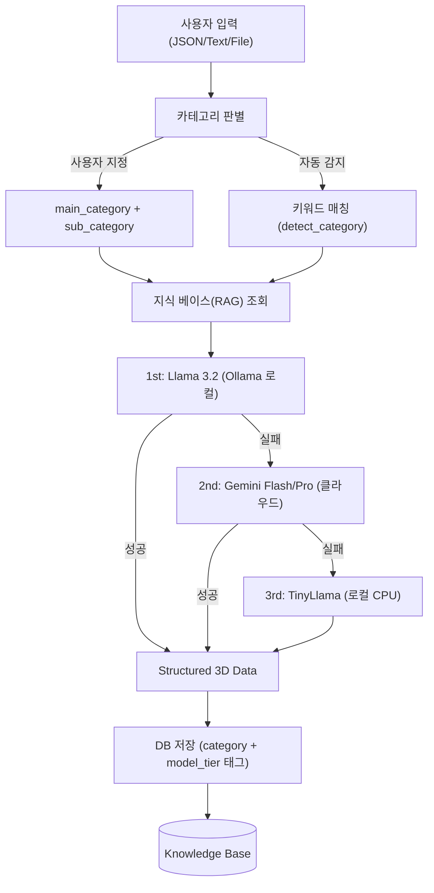

# 🤖 지능형 에이전트 라우팅 및 카테고리 최적화 설계 (AI Agent Routing & Optimization)

본 문서는 Quantum Studio의 AI 분석 엔진에서 발생할 수 있는 속도, 비용, 그리고 모델 전문성 문제를 해결하기 위한 **계층형 로컬 우선 라우팅(Local-First Tiered Routing)** 시스템 설계를 기술합니다.

> **최종 업데이트**: 2026-02-09 — 실제 구현 코드 기준으로 모델 티어링 및 카테고리 체계 업데이트

---

## 🎯 설계 목표
- **보안 및 신뢰**: 특정 국가 모델을 배제하고 Meta(Llama), Google(Gemini) 등 신뢰할 수 있는 모델을 채택합니다.
- **비용 최적화**: 가능한 많은 분석을 로컬 모델(Llama 3.2, TinyLlama)에서 처리하여 API 비용을 최소화합니다.
- **정확도 향상**: 지식 베이스(Knowledge Base) 연동을 통해 특정 카테고리 분석의 신뢰도를 높입니다.
- **속도 향상**: 카테고리별 자동 감지 및 최적 모델 라우팅을 수행합니다.

---

## 🏗️ 시스템 아키텍처

### 1. 카테고리 체계 (`backend-python/app/core/categories.py`)

데이터의 성격에 따라 세분화된 카테고리를 정의하며, 각 카테고리는 권장 모델 티어를 가집니다.

| 카테고리 | 모델 티어 | 설명 |
| :--- | :--- | :--- |
| `FINANCE_TAX` | **PRO** | 세무 및 세금 관련 (전문 지식 필요) |
| `FINANCE_SETTLEMENT` | FLASH | 정산 및 금융 거래 분석 |
| `INFRA_ARCHITECTURE` | **PRO** | 클라우드/인프라 구조 분석 |
| `INFRA_LOG` | LOCAL | 서버 로그 패턴 분석 (단순) |
| `LEGAL_COMPLIANCE` | **PRO** | 법률 및 컴플라이언스 체크 |
| `GENERAL_DOC` | FLASH | 기타 일반 문서 분석 |

### 2. 모델 티어링 — 폴백(Fallback) 기반 아키텍처

실제 구현에서는 고정 티어 할당이 아닌 **순차 폴백 방식**을 채택합니다.

| 우선순위 | 대상 모델 | 호출 방식 | 주요 역할 | 특징 |
| :--- | :--- | :--- | :--- | :--- |
| **1st** | **Llama 3.2** | Ollama API (로컬) | FLASH/PRO 카테고리의 복잡한 추론 | 로컬 GPU, 비용 0, 보안 최상 |
| **2nd** | Gemini 1.5 Flash / Pro | Google GenAI (클라우드) | Ollama 실패 시 클라우드 폴백 | PRO는 구글 검색 Grounding 활용 |
| **3rd** | TinyLlama (1.1B) | Transformers (로컬) | 최후의 수단, 모든 외부 연결 실패 시 | 초경량, CPU 구동 가능 |

### 3. 데이터 흐름 (Data Flow)

---

## 🛠️ 핵심 구현 전략

### 1. 로컬 우선 라우팅 (Local-First Strategy)
- FLASH/PRO 티어 요청은 먼저 로컬 `Ollama`의 **Llama 3.2** 모델로 처리를 시도합니다.
- Ollama가 유효한 결과(`keywords` 필드 존재)를 반환하면 클라우드 API를 호출하지 않습니다.
- 실패 시에만 Gemini API로 폴백하여 비용을 최소화합니다.

### 2. 지식 베이스(Knowledge Base) 및 RAG
- 분석 시점에 로컬 DB(`KnowledgeBase` 테이블)에서 관련 도메인 지식을 조회하여 프롬프트에 주입합니다.
- 모든 티어에서 RAG를 활용할 수 있도록 확장되었습니다 (기존 PRO 전용에서 변경).
- `frontend-admin`의 `/knowledge` 페이지에서 관리자가 지식 항목을 CRUD 관리합니다.
- `quantum-api-admin`의 외부 API 서비스를 통해 공공 데이터(법제처, DART, 한국은행 ECOS)를 자동 수집합니다.
- **효과**: 모델의 환각(Hallucination) 현상을 방지하고 최신 전문 지식을 반영합니다.

### 3. 보안 및 데이터 격리
- 중국 모델을 배제하고 검증된 오픈소스 모델만 사용함으로써 기업용 보안 요구사항을 충족합니다.
- 데이터가 외부로 나가지 않는 **오프라인 분석 모드**를 기본 지향합니다.

### 4. API Rate Limiting
- Gemini API 호출은 분당 14회로 제한됩니다 (`_check_rate_limit`).
- 제한 초과 시 자동으로 로컬 모델로 전환합니다.

---

## 📅 단계별 도입 로드맵
1. **Phase 1**: Ollama 연동 및 Llama 3.2 메인 추론 엔진 도입 (완료)
2. **Phase 2**: 카테고리 기반 티어링 및 RAG 연동 (완료)
3. **Phase 3**: TinyLlama 최전방 필터링 고도화 (진행 중)
4. **Phase 4**: 카테고리별 전문 LoRA 학습 및 모델 스위칭 구현 (예정)

---

*이 문서는 시스템 고도화에 따라 지속적으로 업데이트됩니다.*
