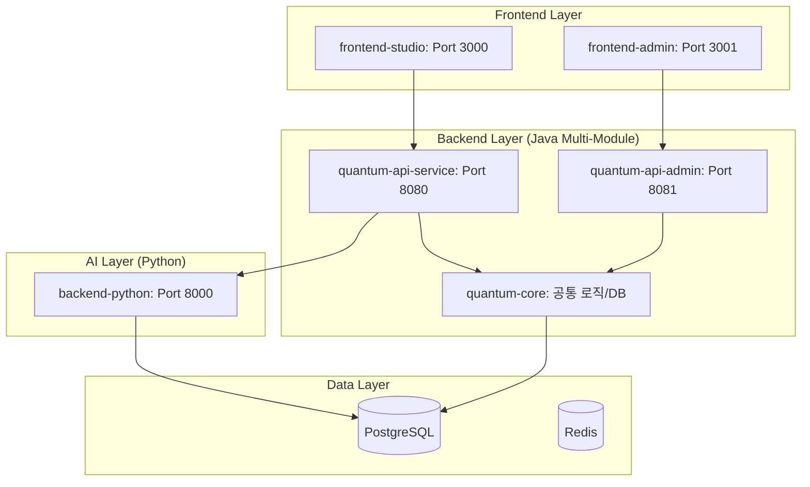

# 🏗️ Quantum Studio 차세대 분리 아키텍처 (WAS 분리형)

본 문서는 보안 강화와 시스템 안정성을 위해 서비스(Studio)와 운영(Admin) 단을 물리적으로 분리한 차세대 아키텍처 설계를 기술합니다.

## 1. 아키텍처 개요
기존의 단일 프로젝트 구조에서 **멀티 프로젝트 및 멀티 모듈** 구조로 전환하여, 각 서비스의 독립성과 보안성을 극대화합니다.

### 🏢 전체 구조도

## 2. 주요 변경 내역 및 역할 분담

### 🌐 Frontend 분리
- **frontend-studio (Port 3000)**: 일반 사용자용 3D 시각화 스튜디오.
- **frontend-admin (Port 3001)**: 관리자 전용 지식 베이스 및 시스템 관리 도구.

### ☕ Java Backend (WAS 분리)
- **quantum-core**: 엔티티(Entity), 리포지토리(Repository), 공통 유틸리티 등 모든 모듈이 공유하는 핵심 비즈니스 도메인.
- **quantum-api-service (Port 8080)**: 
    - 사용자 인증, 결제, 프로젝트 관리 API 제공.
    - 높은 트래픽에 대응하기 위한 스케일 아웃(Scale-out) 구조 지향.
- **quantum-api-admin (Port 8081)**: 
    - 지식 베이스(RAG) 관리, 외부 API(법제처, BOK, DART) 수집 배치.
    - **보안 강화**: 관리자 전용 인증 및 내부망 접근 제어 적용 용이.

### 🐍 Python Backend
- **AI Agent 전용**: Llama 3.2 및 Gemini를 활용한 데이터 분석 및 3D 매핑 추론에만 집중.

## 3. 도입 효과 (Why WAS 분리?)
1. **보안성 (Security)**: 관리자 API가 서비스 API와 물리적으로 분리되어, 서비스단 해킹 시에도 관리자 권한 및 지식 베이스 유출 위험 차단.
2. **안정성 (Stability)**: 서비스단에 과부하가 걸려 서버가 멈춰도, 관리자 서버는 정상 동작하여 긴급 점검 공지나 데이터 복구 작업 가능.
3. **유연성 (Scalability)**: 서비스용 WAS와 관리자용 WAS의 자원 할당량을 다르게 설정하여 비용 효율적 운영 가능.

---
*이 설계는 Quantum Studio가 엔터프라이즈급 서비스로 도약하기 위한 핵심 기반입니다.*
